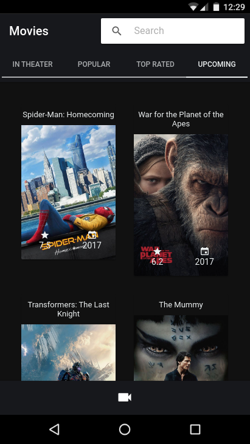

# The Movie Database Ionic App
This is a responsive example app developed using Ionic 3 that calls the movie database API.
It allow user to search for any movie.

## Installation 
If you would like to download the code and try it for yourself:

*please, notive that you might have ionic installed already

1. Clone the repo: https://github.com/vitorsilvalima/ionic-tmdb.git
2. cd ionic-tmdb
3. Install packages: npm install
4. Build project and launch: ionic serve
5. Open your browser at: http://localhost:8100

## Installation Android
* ionic run cordova android
# Screenshot

## Author
[Vitor Lima](https://vitorsilvalima.github.io/)

## License
[MIT](https://github.com/vitorsilvalima/ionic-tmdb/blob/master/License)

